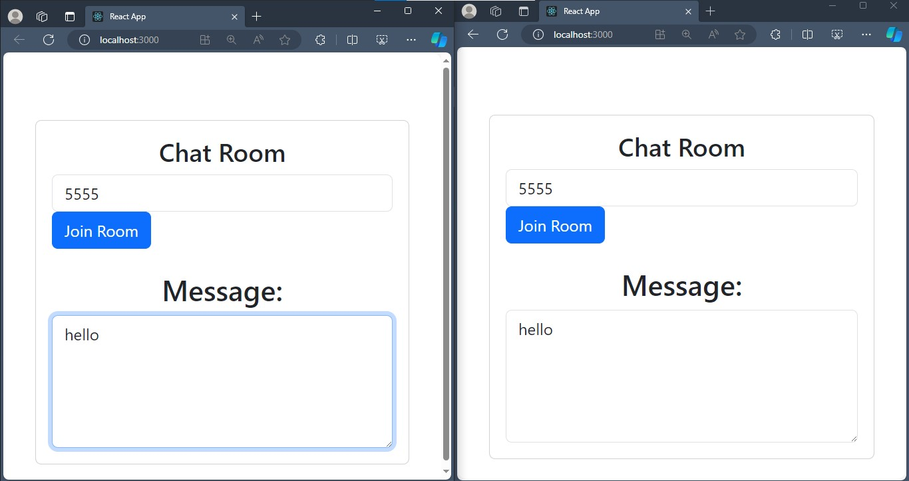
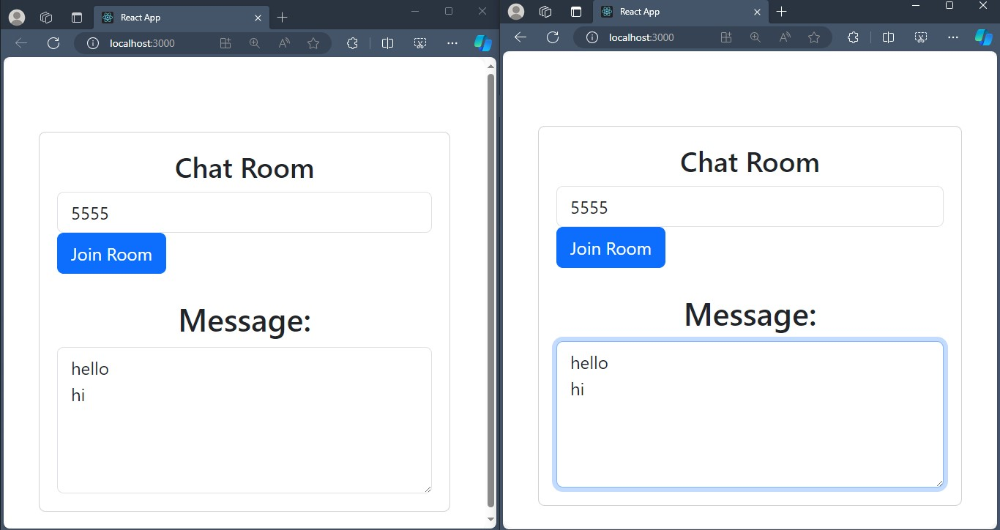

# RealTimeTextCollab

RealTimeTextCollab is a real-time text collaboration application built with ReactJS and NodeJS.

<a href="https://github.com/Bassssem/RealTimeTextCollab/blob/main/video.mp4" >link of video</a>

## Features

- Collaborate in real-time: Create, edit, and share text with multiple users simultaneously.
- Instant synchronization: Changes made by one user are instantly reflected for all participants.
- Seamless teamwork: Ideal for virtual meetings, brainstorming sessions, and collaborative writing.
  
## Getting Started

1. Clone this repository.
2. Navigate to the `client` directory and run `npm install` to install dependencies.
3. Navigate to the `server` directory and run `npm install` to install dependencies.
4. Start the client and server:
   - For the client, run `npm start`.
   - For the server, run `npm start`.
5. Open your browser and go to `http://localhost:3000` to use RealTimeTextCollab.

## Technologies Used

- ReactJS
- NodeJS
- Socket.IO

## Contributing

Contributions are welcome! Feel free to open an issue or submit a pull request.

## License

This project is licensed under the [MIT License](LICENSE).
